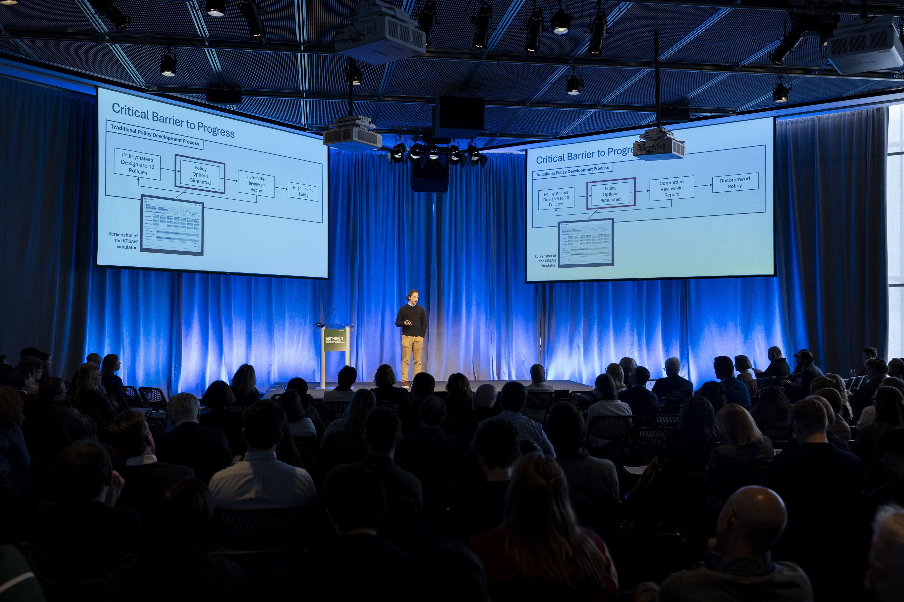
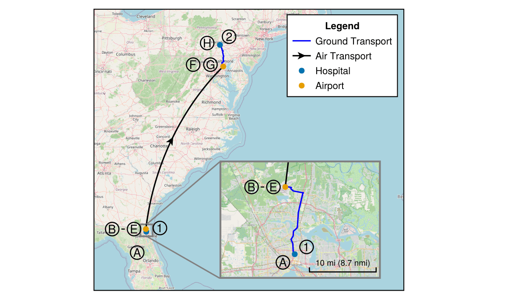
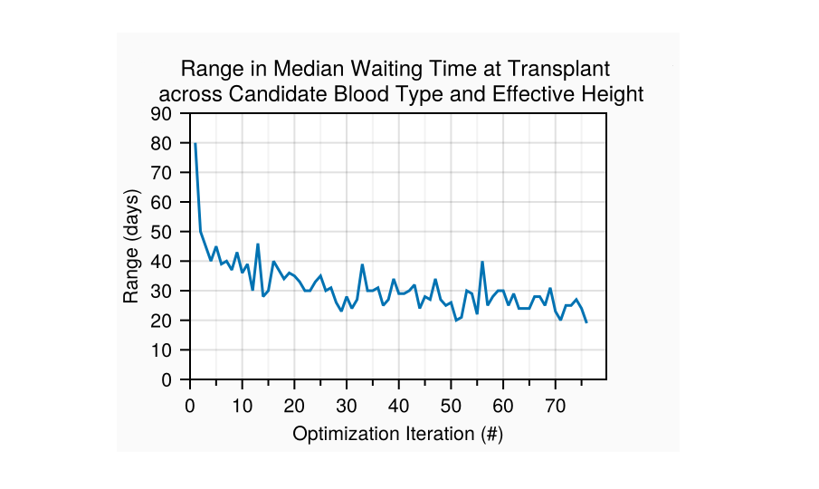

::: {.profile-layout}



::: {.profile-main}

# Welcome

Welcome to my personal website! I'm a researcher interested in using computational methods like optimization, simulation, and machine learning to address complex societal challenges. I recently completed my PhD at MIT's Institute for Data, Systems, and Society and I am now a postdoc at the MIT Sloan School of Management. I've been advised by Professor Dimitris Bertsimas for both. Since starting my PhD, my main focus has been the U.S. organ transplant system. Thank you for visiting my website and please feel free to reach out through LinkedIn or email if you'd like to connect!

## Research Highlights

::: {.research-grid}

::: {.research-card}

::: {.research-card-visual}
{.research-card-image fig-alt="Elijah Pivo speaking at the 2026 Annual HEALS Symposium."}
:::

::: {.research-card-body}
Symposium presentation · 2026

### 2026 MIT HEALS Symposium

I presented my research at the first annual MIT Health and Life Sciences (HEALS) symposium.

::: {.research-card-action}
[Watch the talk →](files/videos/heals_symposium_2026.mp4){.research-card-link}
:::

:::

:::

::: {.research-card}

::: {.research-card-visual}
{.research-card-image .lightbox fig-alt="Diagram showing an organ allocation policy with adjustable priorities being evaluated through computer simulation to predict effects on waitlist mortality, organ utilization, and pediatric access."}
:::

::: {.research-card-body}
Published · 2025

### High-Speed Simulation of the U.S. Organ Transplant System

This work develops a new algorithm that reduces simulation runtimes from hours to seconds, easing a critical bottleneck in national policymaking.

::: {.research-card-action}
[Read the article →](files/publications/Modernizing_the_Design_Process_for_US_Organ_Allocation_Policy_Toward_a_Continuous_Distribution_Policy_for_Kidneys.pdf){.research-card-link}
:::

:::

:::

::: {.research-card}

::: {.research-card-visual}
{.research-card-image fig-alt="Map illustrating geographic access and time-sensitive kidney transportation."}
:::

::: {.research-card-body}
Working paper

### Addressing Geographic Disparities in Kidney Transplantation

How can we provide consistent access to transplantation across the United States when time-sensitive logistics constrain how far donated kidneys can travel?

::: {.research-card-action}
[Read the paper →](files/working_papers/Pivo_Kidney_Geography_Paper__Preprint.pdf){.research-card-link}
:::

:::

:::

::: {.research-card}

::: {.research-card-visual}
{.research-card-image fig-alt="Illustration of organ allocation decisions in lung transplantation."}
:::

::: {.research-card-body}
Working paper

### Mitigating the Effects of Physiology on Access to Lung Transplantation

In this project, we introduce new optimization techniques to help policymakers compensate for a patient's blood type and chest cavity size.

::: {.research-card-action}
[Read the paper →](files/working_papers/Pivo_Lung_ABOChestSize_Paper__Preprint.pdf){.research-card-link}
:::

:::

:::

:::

:::

:::