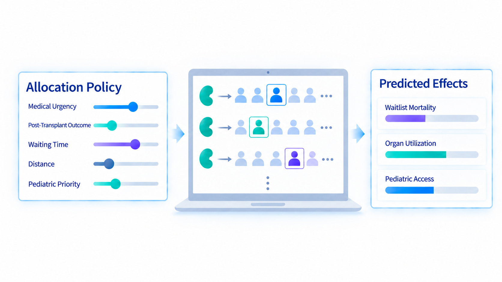

::: {.profile-layout}



::: {.profile-main}

# Welcome

Welcome to my personal website! I'm a researcher interested in using computational methods like optimization, simulation, and machine learning to address complex societal challenges. I recently completed my PhD at MIT's Institute for Data, Systems, and Society and I am now a postdoc at the MIT Sloan School of Management. I've been advised by Professor Dimitris Bertsimas for both. Since starting my PhD, my main focus has been the U.S. organ transplant system. Thank you for visiting my website and please feel free to reach out through LinkedIn or email if you'd like to connect!

## Research Highlights

::: {.research-grid}

::: {.research-card}

::: {.research-card-visual}
[{.research-card-image fig-alt="Diagram showing an organ allocation policy with adjustable priorities being evaluated through computer simulation to predict effects on waitlist mortality, organ utilization, and pediatric access."}](files/publications/Modernizing_the_Design_Process_for_US_Organ_Allocation_Policy_Toward_a_Continuous_Distribution_Policy_for_Kidneys.pdf)
:::

::: {.research-card-body}
Published · 2025

### High-Speed Simulation of the U.S. Organ Transplant System

This work develops a new algorithm that reduces simulation runtimes from hours to seconds, easing a critical bottleneck in national policymaking.

::: {.research-card-action}
[Read the article →](files/publications/Modernizing_the_Design_Process_for_US_Organ_Allocation_Policy_Toward_a_Continuous_Distribution_Policy_for_Kidneys.pdf){.research-card-link}
:::

:::

:::

::: {.research-card}

::: {.research-card-visual}
[{.research-card-image fig-alt="Map illustrating geographic access and time-sensitive kidney transportation."}](files/working_papers/Pivo_Kidney_Geography_Paper__Preprint.pdf)
:::

::: {.research-card-body}
Working paper

### Geographic Access in Kidney Transplantation

How can organ transportation and allocation policies improve access to transplantation when time-sensitive logistics constrain how far donated kidneys can travel?

::: {.research-card-action}
[Read the paper →](files/working_papers/Pivo_Kidney_Geography_Paper__Preprint.pdf){.research-card-link}
:::

:::

:::

::: {.research-card}

::: {.research-card-visual}
[{.research-card-image fig-alt="Illustration of organ allocation decisions in lung transplantation."}](files/working_papers/Pivo_Lung_ABOChestSize_Paper__Preprint.pdf)
:::

::: {.research-card-body}
Working paper

### Lung Allocation and Biological Access

This project develops optimization-based approaches to organ-allocation policy that mitigate biological disparities in access to lung transplantation.

::: {.research-card-action}
[Read the paper →](files/working_papers/Pivo_Lung_ABOChestSize_Paper__Preprint.pdf){.research-card-link}
:::

:::

:::

::: {.research-card}

::: {.research-card-visual}
[{.research-card-image fig-alt="Chart showing the effects of delays and capacity saturation in contact tracing."}](files/publications/Respect_the_Unstable_Delays_and_Saturation_in_Contact_Tracing_for_Disease_Control.pdf)
:::

::: {.research-card-body}
Published · 2022

### Delays and Saturation in Contact Tracing

This work studies how operational delays and limited tracing capacity can destabilize disease-control systems and undermine public-health interventions.

::: {.research-card-action}
[Read the article →](files/publications/Respect_the_Unstable_Delays_and_Saturation_in_Contact_Tracing_for_Disease_Control.pdf){.research-card-link}
:::

:::

:::

:::

:::

:::